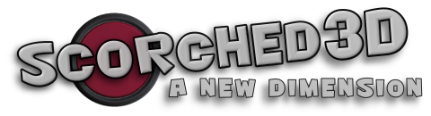
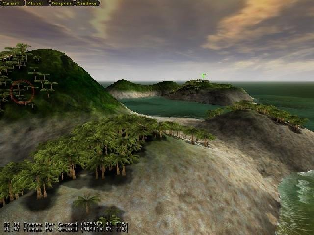
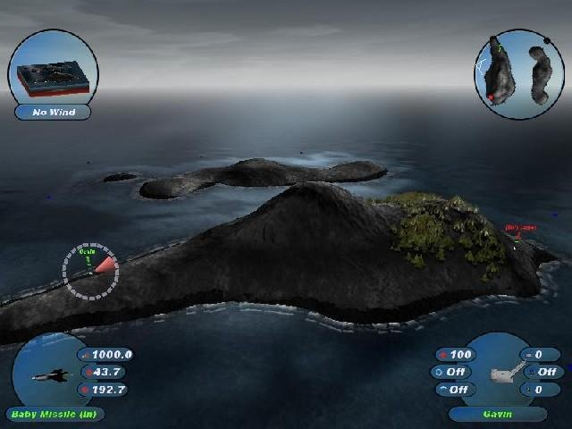
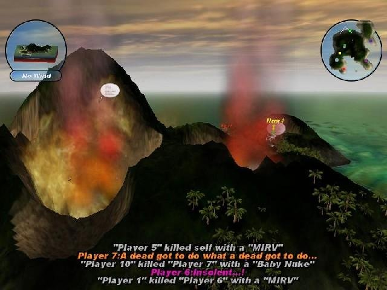
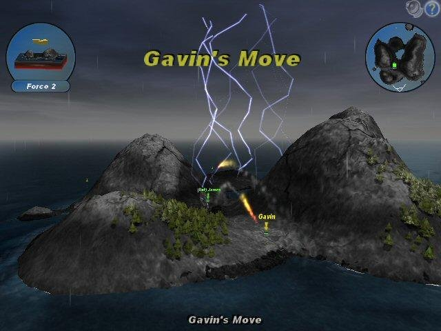

Scorched3D incorporates lively, fully destructible 3D landscapes that include animated jets, naval vessels, water and even birds, with detailed tanks and projectiles and stunning visual effects.

<a href='.images/6700.jpg'>

</a>
<a href='.images/6702.jpg'>

</a>
<a href='.images/6704.jpg'>

</a>
<a href='.images/8943.jpg'>

</a>

A simple turn-based artillery game and also a real-time strategy game in which players can counter each others' weapons with other creative accessories, shields and tactics. Test your skill in timing, aiming and judgement of distance, move around on the landscape, or outsmart your opponent economically.

## Features

-	Realisticly rendered 3D landscape environments
-	Real-time or turn-based artillery combat
-	Online or offline, single or multi-player play
-	Mod support for various gaming styles
-	Tournament and stats championships

## Gameplay

Learning how to play is easy, just point the turret, adjust power and trajectory, select a weapon – and shoot!

Manage your inventory of weapons with the prize money you win during each round of combat. Learn the basic controls using the tutorial mode, or set up your own game by customising dozens of economy and environmental conditions to your liking, or simply play online immediately at one of the various public servers.

You can play with up to twenty-four other players at a time, mixing computer players with humans on both randomly generated landscapes and user-designed maps. Scorched3D comes bundled with Apocalypse mod, which offers enhanced levels of weaponry.

## Get

Scorched3D is currently available for several Linux distribution from [Open Build Service (OBS)](https://build.opensuse.org/)

Develop: [](https://build.opensuse.org/package/show/home:bberberov:develop:Multi/scorched3d)  
Testing: [](https://build.opensuse.org/package/show/home:bberberov:testing:Multi/scorched3d)  
Release: :construction:

:construction: Installers/Apps for Microsoft Windows and macOS operating systems may be available in the future


### From OBS
-	**Click** on one of the _Build Service_ badges above, to go to the package page for the build quality you would like to install.  
	The _Build Results_ table on the right shows the available distributions.
-	**Click** on your distribution in the _Build Results_ table, to go to the _Repository State_ page
-	**Click** on the _Go to download repository_ link at the top, to go to the _Repository_ page
-	**Use** the URL to add the repository to your distribution

## Building

### Dependencies

-	[pkg-config](https://www.freedesktop.org/wiki/Software/pkg-config/) >= 0.29 or [pkgconf](http://pkgconf.org/)
-	[OpenAL](https://www.openal-soft.org/) >= 1.17.2
-	[Freealut](https://github.com/vancegroup/freealut)
-	[FFTW3](https://www.fftw.org/)
-	[Freetype](https://freetype.org/)
-	OpenGL, GLEW
-	[OGG](https://www.xiph.org/ogg/) and [Vorbis](https://xiph.org/vorbis/)
-	SDL 1.2.x series, SDL_net
-	[wxWidgets](https://www.wxwidgets.org/)
-	[expat](https://libexpat.github.io/)
-	[zlib](http://zlib.net/)
-	[libpng](http://www.libpng.org/)

### Optional Dependencies

-	`xdg-utils` for opening web links, or any browser configurable at compile-time
-	MySQL or PostgreSQL

### Compiling

#### Linux

Scorched3D uses an [Autoconf](https://www.gnu.org/software/autoconf/autoconf.html) build process, derived from the Visual Studio project files

-	Run `createAMMakefile.pl` from its directory to create the necesary `Makefile.am` from the Visual Studio project files
	```bash
	cd scripts
	perl createAMMakefile.pl
	cd ..
	```
-	Reconfigure with `autoreconf -fiv`
-	Configure with `./configure ...`
-	Build with `make ...`
-	Install with `make install ...`

#### Windows

:construction: The included Visual Studio project files have not been tested

#### macOS

:construction:

## License

Licensed under the terms of the [GNU General Public License v2.0 or later](https://www.gnu.org/licenses/old-licenses/gpl-2.0.html)
___

## Original README

Scorched3D : Copyright 2009 Gavin Camp

For Scorched3D updates and news visit http://www.scorched3d.co.uk

For Scorched3D documentation visit http://www.scorched3d.co.uk/wiki

For information on how to compile Scorched3D visit http://www.scorched3d.co.uk/wiki/index.php/Scorched3D_Development

For Scorched3D license information see the documentation directory.

For Apocalypse mod updates and news visit http://apochq.handwired.net
